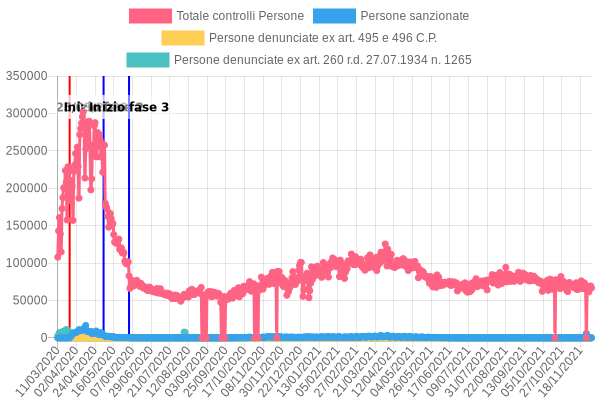
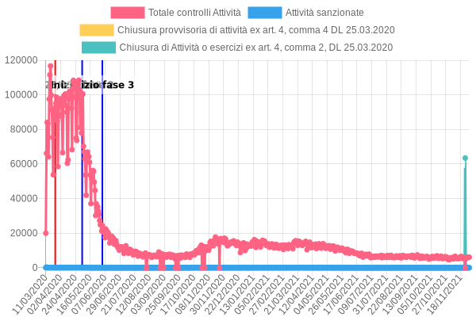
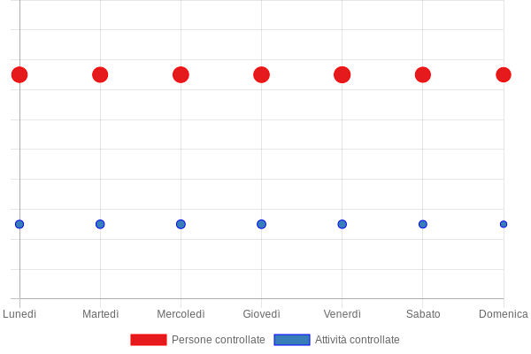

## Cosa c'è in questo repo

I dati sui controlli di polizia effettuati durante l'emergenza COVID-19 in Italia sono pubblicati tutti i giorni sul sito del Ministero dell'Interno in formato PDF. questo repository contiene i medesimi dati in formato *machine readable*.

**Nota**: questo non è un dataset ufficiale, anche se basato sui dati rilasciati dal Ministero dell'Interno. L'aggiornamento con i dati del Ministero è fatto con cadenza giornaliera, ma in caso di discrepanza tra i dati, fare riferimento ai dati del Ministero.

**Nota 2**: questo sistema potrebbe smettere di funzionare, o con errori rispetto alla controparte ufficiale in PDF. Potete contribuire a questo progetto proponendo miglioramenti e/o correzioni, oppure chiedendo che i medesimi dati vengano pubblicati in formato *machine readable* dal Ministero stesso.

### Output

Questo repository contiene 2 formati di output per i dati: JSON e CSV.

Nelle relative cartelle potete trovare i file contenenti le informazioni per ciascun giorno: ciascun file contiene i dati relativi alla data associata nel filename.

Esistono 2 file "speciali" per ciascun formato, chiamati `totals.csv` e `totals.json`, contenenti la serie completa dei dati.

Il file `totals.json` contiene tutte le informazioni riguardo i dataset - note comprese - oltre ad una indicizzazione dei record per data nella proprietà `lookup`, ed una versione lista nella proprietà `series`.

### Grafici

Questi grafici sono aggiornati giornalmente con gli ultimi dati.

